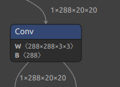
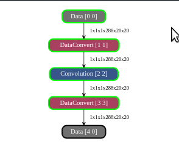
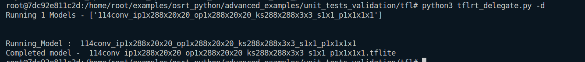
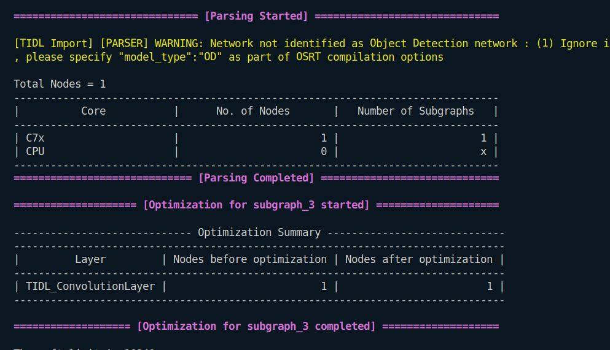
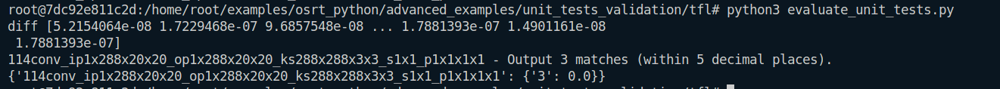

## Convolution Layer
1. 
```
Input : 1x288x20x20
Output : 1x288x20x20
Kernel : 288x288x3x3
Stride : 1x1
Padding : 1x1x1x1
```
### In Netron

### In Model Artifact

### Running on ARM

### Running on TIDL

### Evaluation


