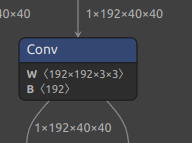
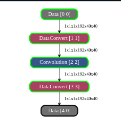
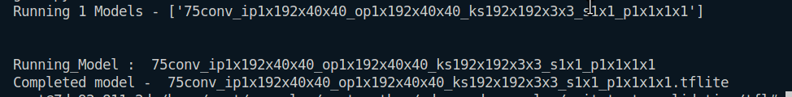
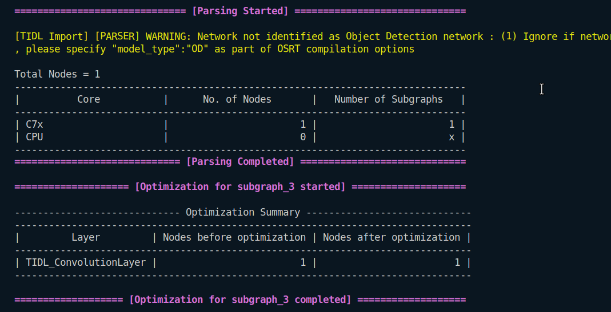
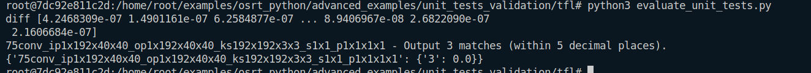

## Convolution Layer
1. 
```
Input : 1x192x40x40
Output : 1x192x40x40
Kernel : 92x192x3x3
Stride : 1x1
Padding : 1x1x1x1
```
### In Netron

### In Model Artifact

### Running on ARM

### Running on TIDL

### Evaluation
