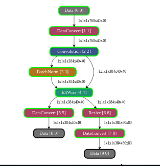
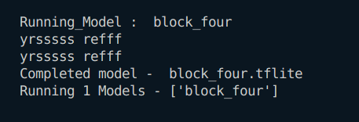
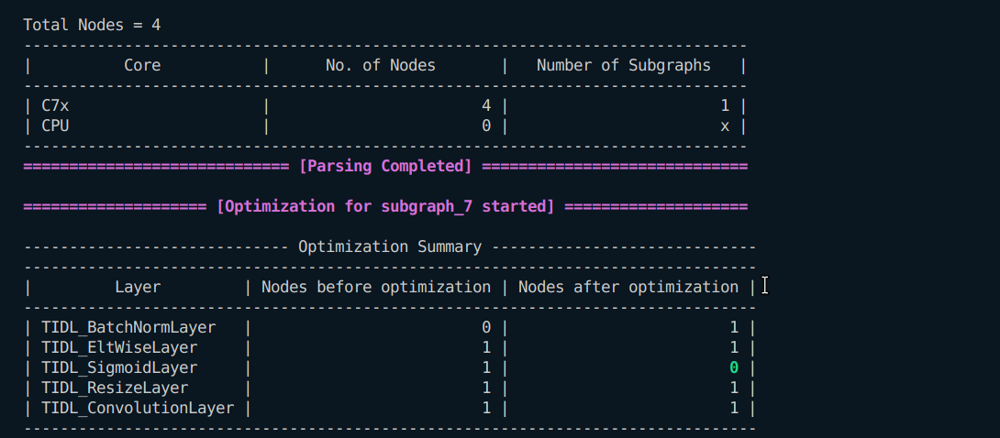
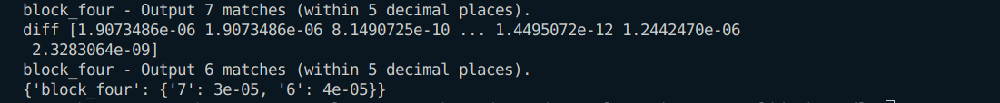

### 1. 
```
Input : 1x768x40x40
Output : 1x384x80x80
Kernel1 : 384x768x1x1
Stride1 : 1x1
Padding2 : 1x1x1x1
```
### In Netron

### In Model Artifact

### Running on ARM

### Running on TIDL

### Evaluation
