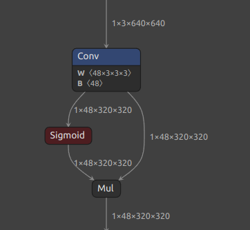
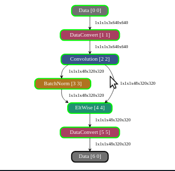
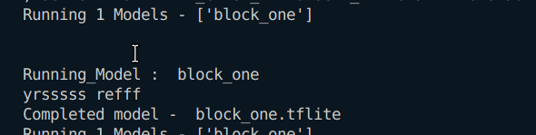
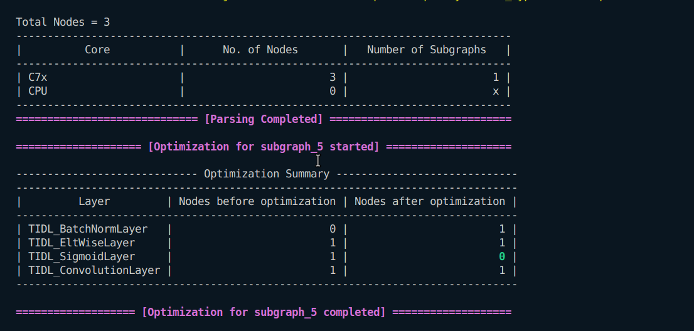
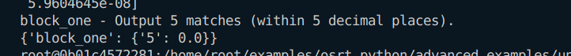

## Block One (Conv -> Sigmoid -> Mul)
### 1. 
```
Input : 1x3x640x640
Output : 1x48x320x320
Kernel : 48x3x3x3
Stride : 2x2
Padding : 1x1x1x1
```
### In Netron

### In Model Artifact

### Running on ARM

### Running on TIDL

### Evaluation

--
### 2. 
```
Input : 1x3x640x640
Output : 1x48x320x320
Kernel : 48x3x3x3
Stride : 2x2
Padding : 1x1x1x1
```
### In Netron

### In Model Artifact

### Running on ARM

### Running on TIDL

### Evaluation
