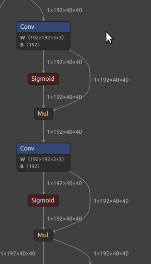
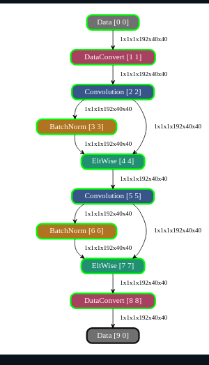
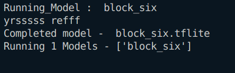
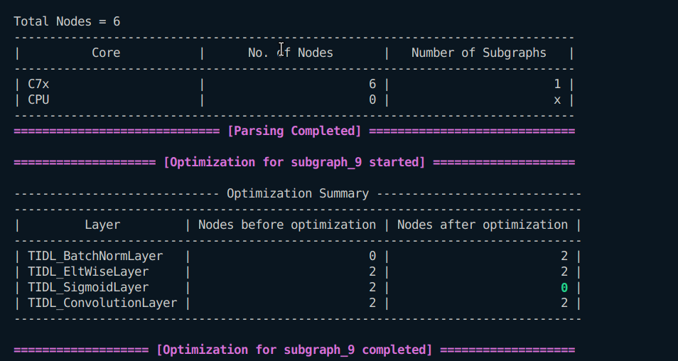

### 1. 
```
Input : 1x192x40x40
Output : 1x192x40x40
Kernel1 : 192x192x3x3
Stride1 : 1x1
Padding1 : 1x1x1x1
Kernel2 : 192x192x3x3
Stride2 : 1x1
Padding2 : 1x1x1x1
```
### In Netron

### In Model Artifact

### Running on ARM

### Running on TIDL

### Evaluation

