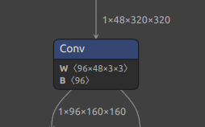
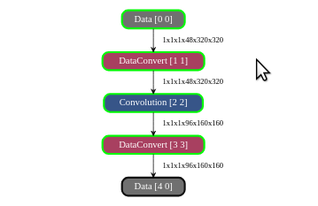
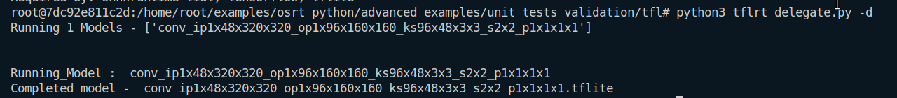
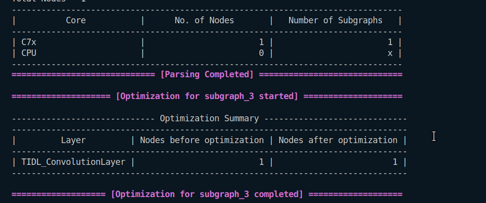
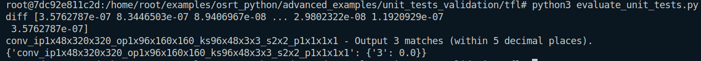

## Convolution Layer
1. 
```
Input : 1x48x320x320
Output : 1x96x160x160
Kernel : 96x48x3x3
Stride : 2x2
Padding : 1x1x1x1
```
### In Netron

### In Model Artifact

### Running on ARM

### Running on TIDL

### Evaluation
