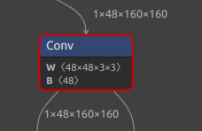
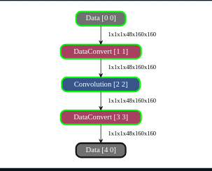
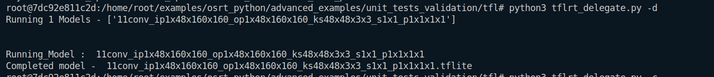
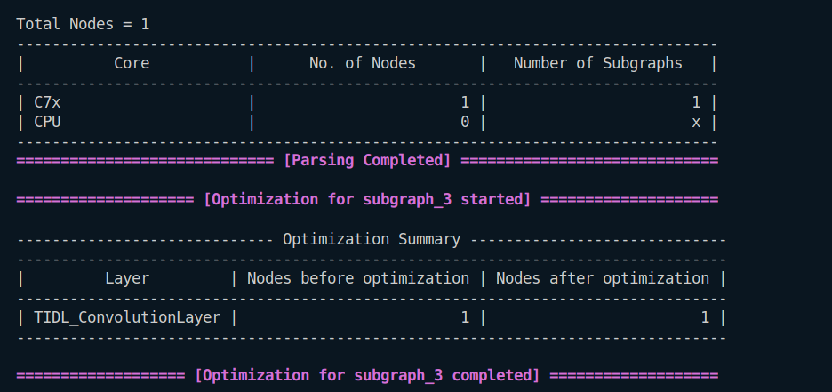
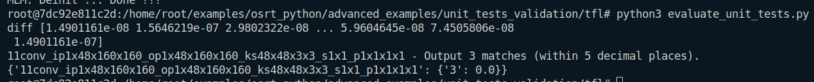

```
Input : 1x48x160x160
Output : 1x48x160x160
Kernel : 48x48x3x3
Stride : 1x1
Padding : 1x1x1x1
```
### In Netron

### In Model Artifact

### Running on ARM

### Running on TIDL

### Evaluation
