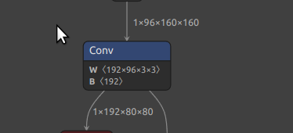
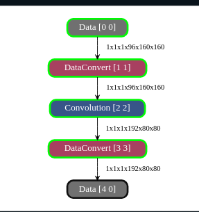
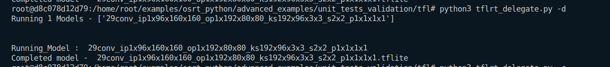
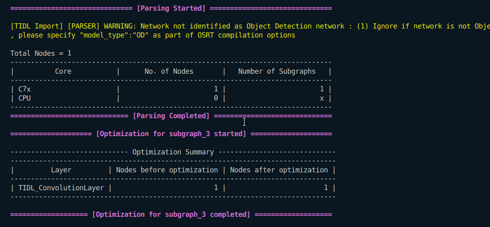
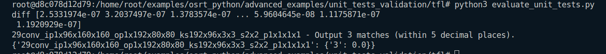

## Convolution Layer
1. 
```
Input : 1x96x160x160
Output : 1x192x80x80
Kernel : 192x96x3x3
Stride : 2x2
Padding : 1x1x1x1
```
### In Netron

### In Model Artifact

### Running on ARM

### Running on TIDL

### Evaluation
