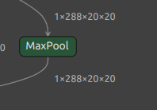
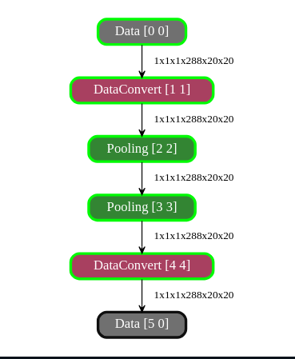
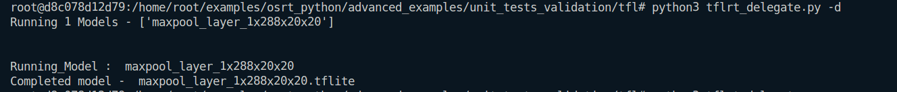
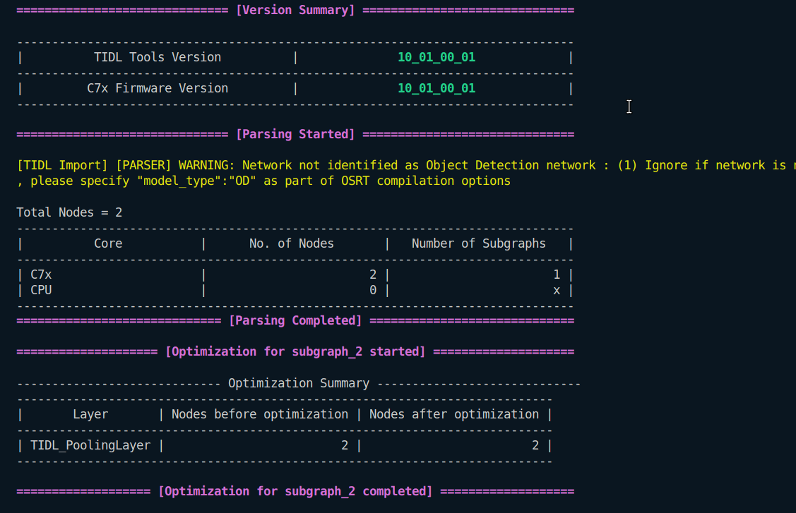
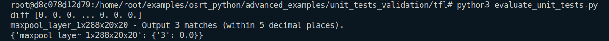

## MaxPool Layer
1. 
```
Input : 1x288x20x20
Output : 1x288x20x20
Kernel : 5x5
Stride : 1x1
Padding : 2x2x2x2
```
### In Netron

### In Model Artifact (No maxpool layer)

### Running on ARM

### Running on TIDL

### Evaluation
