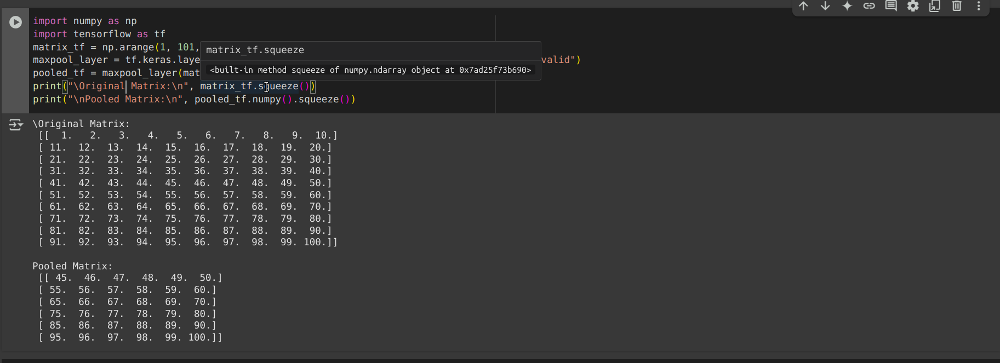
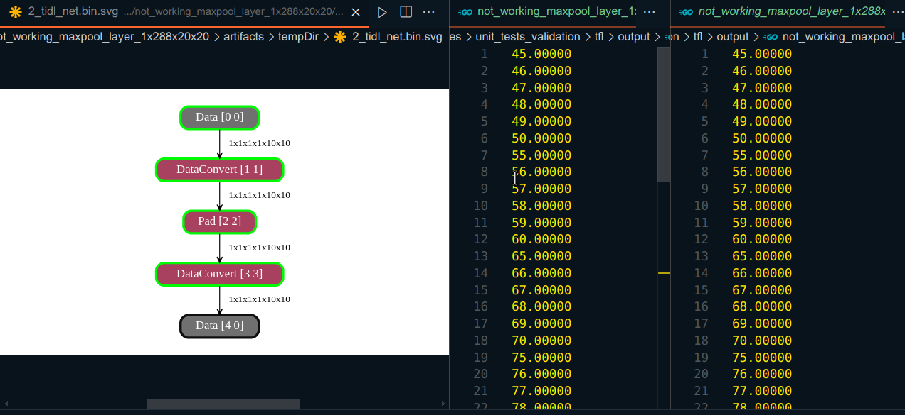
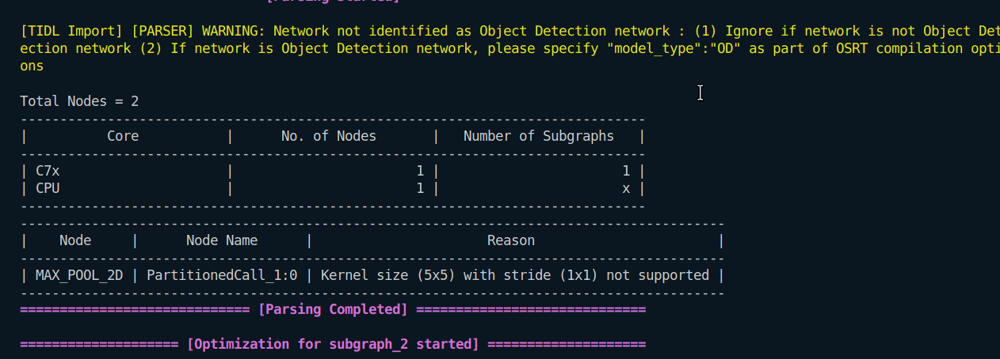

* I implemented the noxmal maxpool for 10x10 matrix with sequence value of 1-100  width 5x5 kernel and stride of 1x1 in python code

* The same operation model i created with the help of tensorflow , but in model artifacts ,the pooling layer is not created but it did the maxpool operation corretly (compare the output with the above image)

* So in summary it do the maxpool operation but it showing error during compilation of TIDL
